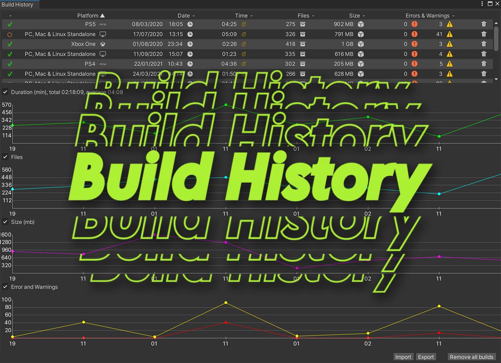
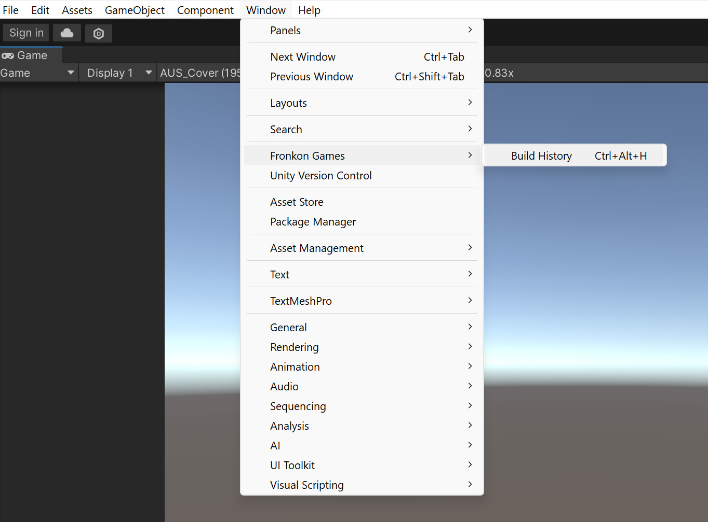
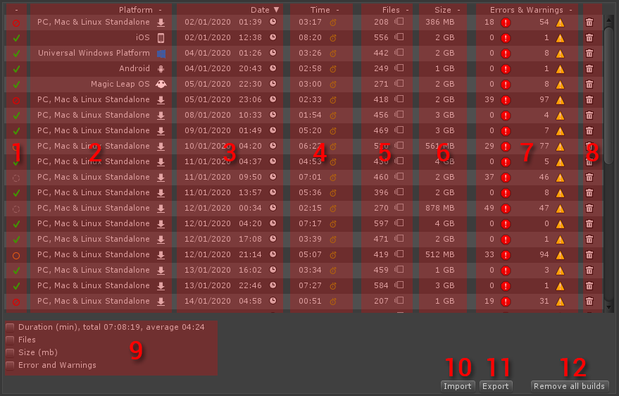
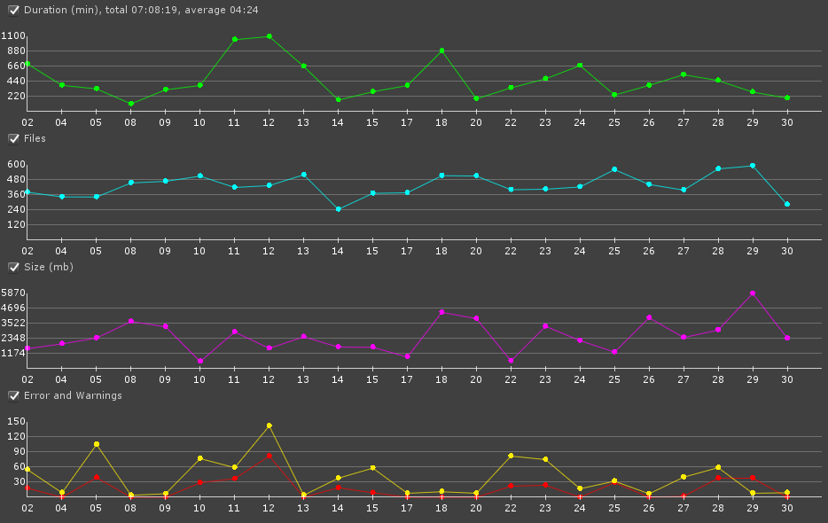

<p align="center"></p>

<br>
<p align="center">
  <a style="text-decoration:none">
    
  </a>  
  <a style="text-decoration:none">
    
  </a>
  <a style="text-decoration:none">
    
  </a>
</p>

It keeps the information of all the builds you do and represents their data in graphs.

## 🎇 Features

- Automatically records the result of each build.
- Import and export data in CSV files.

## 🔧 Requisites

- Unity 2021.3 or higher.

## ⚙️ Installation

### Editing your 'manifest.json'

- Open the manifest.json file of your Unity project.
- In the section "dependencies" add:

```c#
{
  ...
  "dependencies":
  {
    ...
    "FronkonGames.Tools.BuildHistory": "git+https://github.com/FronkonGames/Build-History.git"
  }
  ...
}
```

### Git

Just clone the repository into your Assets folder:

```c#
git clone https://github.com/FronkonGames/Build-History.git 
```

### Zip

Download the [latest release](https://github.com/FronkonGames/Build-History/releases) and unzip it into the Assets directory.

## 🚀 Use

Simply use the menu 'Windows > Fronkon Games > Build History'.

<p align="center"></p>

And you'll see something like this:

<p align="center"></p>

At the top you will see a list with information about all the builds you make. The first column (1) shows whether the compilation finished successfully or not.

The next column (2) shows the platform of the build. The third and fourth columns show the date (3) and how long it lasted (4).

In the next two you can see how many files were processed (5) and the final size (6). The last column (8) informs you about how many errors and warnings occurred.
Finally, you can click on the trash icon (8) to delete that row.

By activating some of the checkbox at the bottom (9) you can activate a more visual way to see parameters such as duration, files, size and errors / warnings.

<p align="center"></p>

Finally you can import (10) / export (11) or delete all the data (12) by clicking on any of the buttons at the bottom.

## 📜 License

Code released under [MIT License](https://github.com/FronkonGames/Build-History/blob/main/LICENSE.md).
